# Zero AI Assistant

## Описание проекта

Zero AI Assistant — это Telegram-бот, разработанный на Python с использованием Aiogram и Django.

Проект предназначен для взаимодействия с пользователем через Telegram-интерфейс и включает функции AI-ассистента, работы с документами, управления задачами и хранения пользовательских данных.

Бот поддерживает мультиязычность, систему профилей пользователей и обработку документов с помощью локальной AI-модели Mistral через Ollama.


## Основные возможности

- Регистрация пользователей
- Система профилей
- Смена языка интерфейса
- Управление задачами
- История активности пользователя
- AI-чат
- Загрузка документов
- Анализ документов через AI
- Краткое содержание документов
- Поддержка TXT, PDF и DOCX файлов
- Обработка ошибок и неизвестных команд

---

## Используемые технологии

- Python
- Aiogram
- Django
- SQLite
- Ollama
- Mistral AI
- pdfplumber
- python-docx

---

## Структура проекта

```text
ai_assistant_bot/
│
├── handlers/
├── keyboards/
├── states/
├── core/
├── webapp/
├── files/
├── main.py
├── config.py
├── requirements.txt
└── README.md
````

---

## Установка проекта

### 1. Клонирование проекта

```bash
git clone <repository_url>
```

### 2. Установка зависимостей

```bash
pip install -r requirements.txt
```

### 3. Настройка Telegram Bot Token

Создайте файл `.env`

```env
BOT_TOKEN=your_bot_token
```

---

## Настройка Django

### Выполнение миграций

```bash
cd webapp
python manage.py migrate
```

### Создание суперпользователя (необязательно)

```bash
python manage.py createsuperuser
```

## Запуск проекта

### Запуск Django сервера

```bash
cd webapp
python manage.py runserver
```

### Запуск Telegram-бота

```bash
python main.py
```

## Примеры функций бота

### Tasks

* добавление задач
* просмотр задач
* удаление задач

### Documents

* загрузка PDF/DOCX/TXT
* AI-анализ документа
* генерация краткого содержания
* ответы на вопросы по документу

### Profile

* просмотр профиля
* смена языка

## Скриншоты

## Скриншоты

### Главное меню

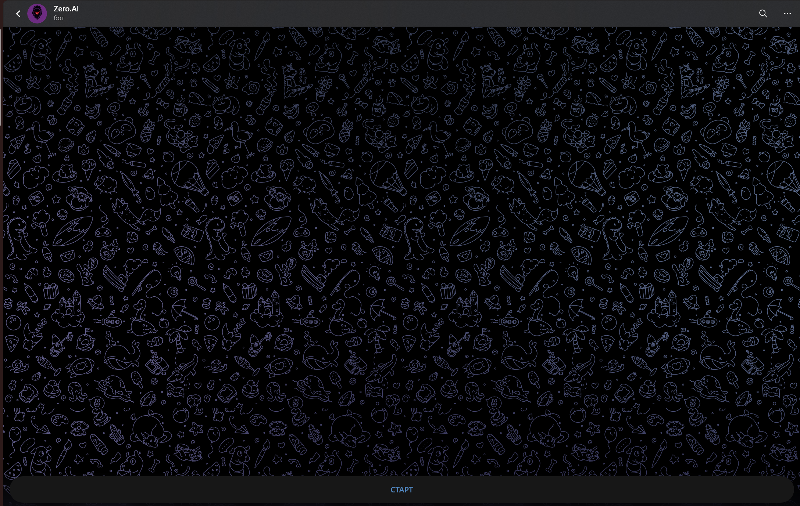

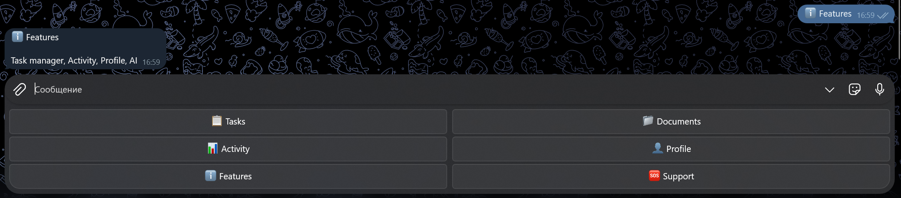

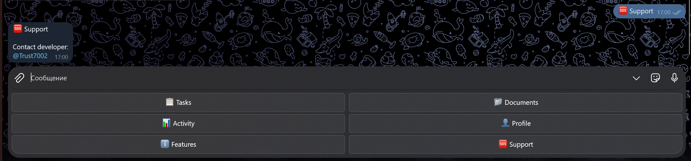

---

### Регистрация пользователя

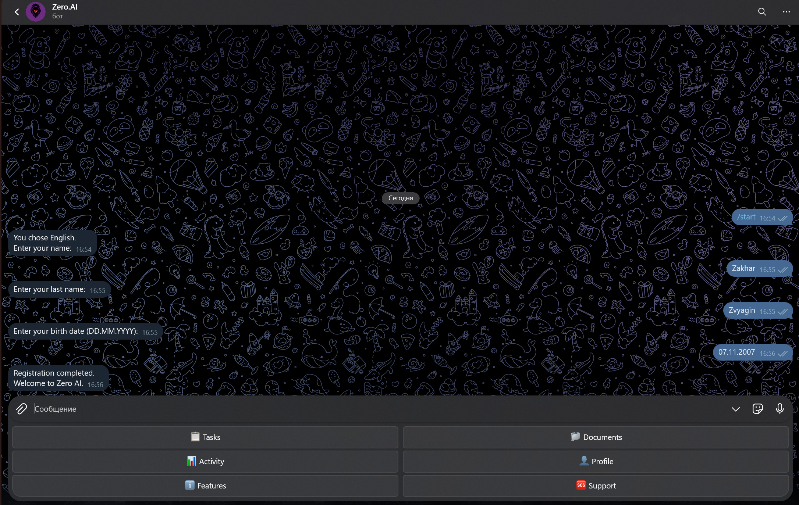


---

### Профиль и настройки

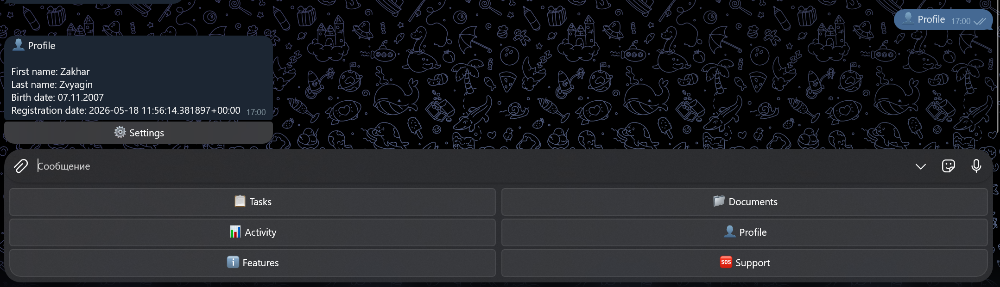

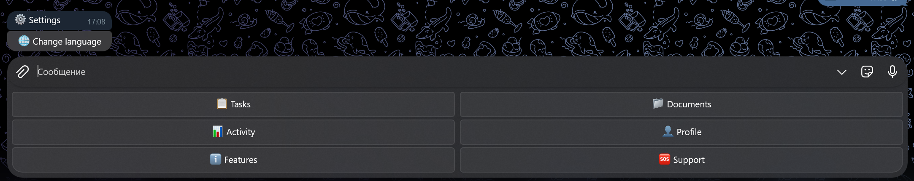

---

### Activity

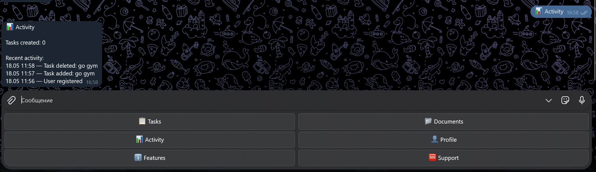

---

### Tasks Function

#### Меню задач


#### Мои задачи


#### Удаление задачи


---

### Documents Function

#### AI чат


#### Выбор типа документа


#### Загрузка документа


#### Summary


---

### Django Admin

#### Главная страница Django Admin

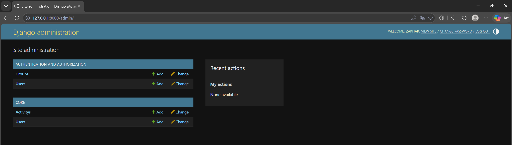

#### Пользователи системы

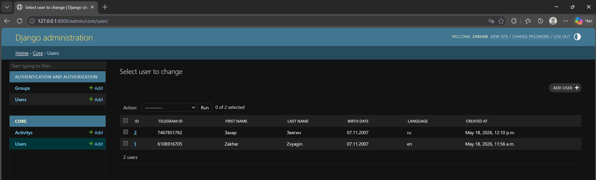

#### Активность пользователей

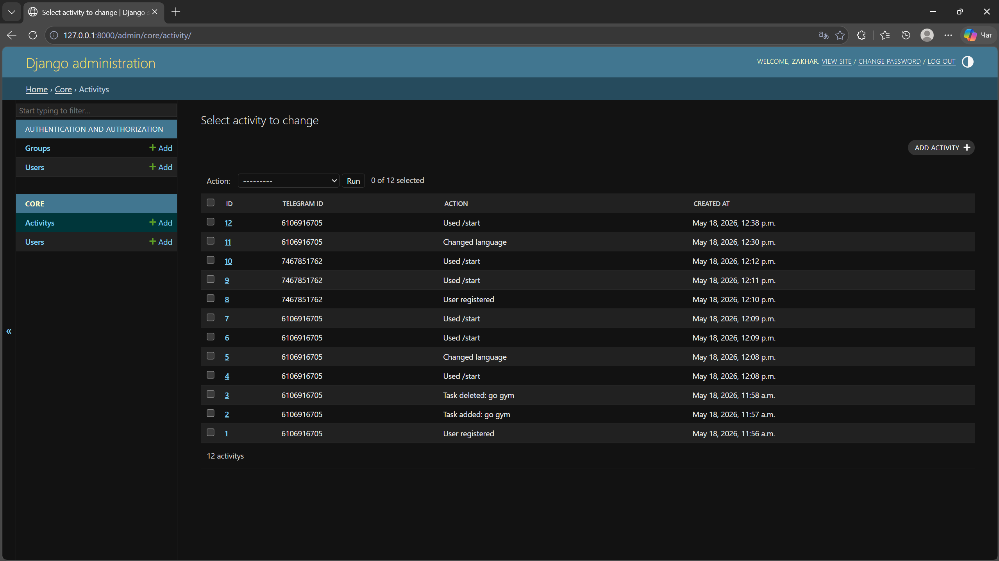

#### Django Authentication Users

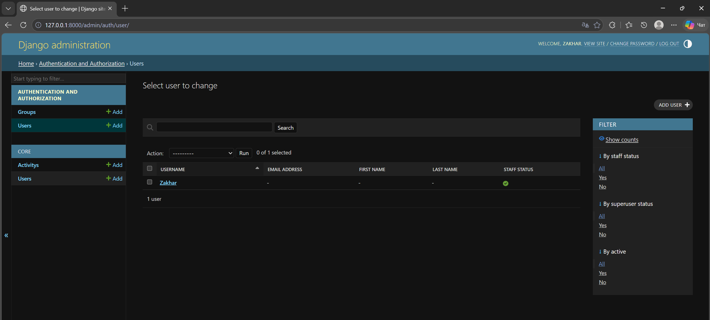

## Автор

Захар Звягин

## Заключение

В ходе проекта был разработан Telegram AI Assistant с использованием Python, Django и Aiogram.

Проект демонстрирует работу с Telegram Bot API, базой данных, обработкой документов, пользовательскими состояниями и интеграцией AI-модели.

```
```
